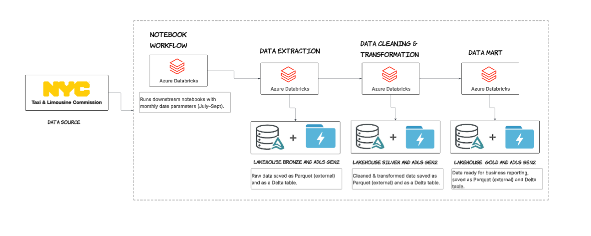
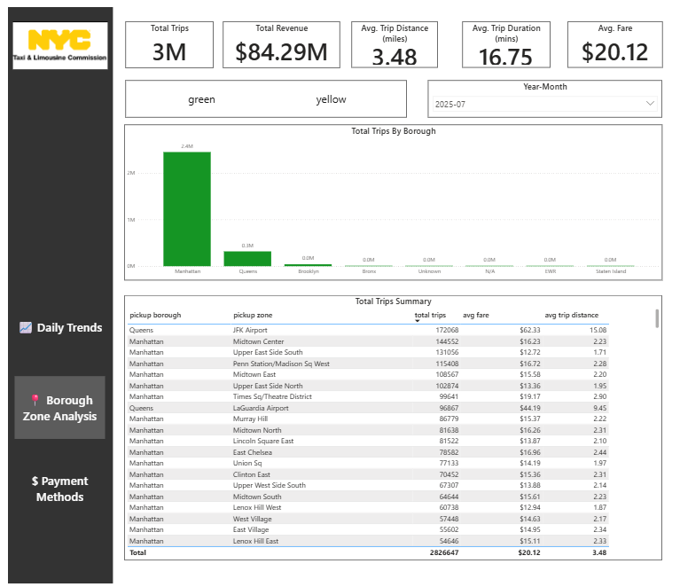
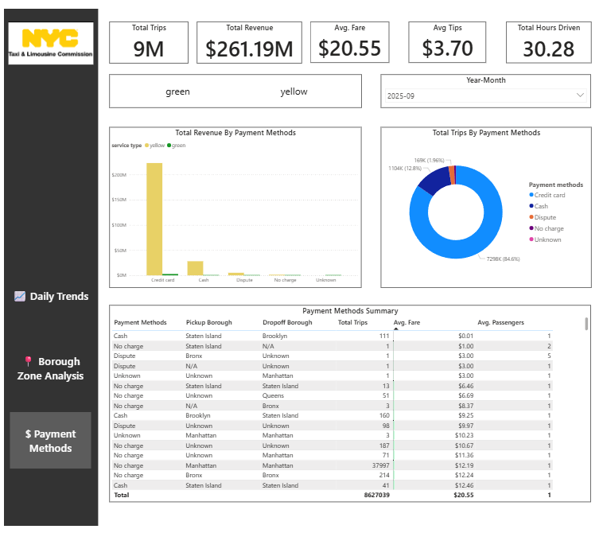

# Analyzing Green-Yellow Taxi Trips Data For NYC (2025 – July, August & September)

## Aim:
To design and implement a scalable Azure Lakehouse pipeline using Databricks, Unity Catalog, and ADLS Gen2 to ingest, clean, and transform NYC Green and Yellow Taxi Trip data for July, August, and September 2025 into Bronze, Silver, and Gold layers, enabling high-quality analytics and interactive Power BI dashboards.

## Technologies Used
1. NYC Taxi Trips Data - Public dataset providing Yellow and Green taxi trip records for July–September 2025. [LINK](https://www.nyc.gov/site/tlc/about/tlc-trip-record-data.page)
1. ADLS Gen2 – Cloud storage used for raw, bronze, silver, and gold data layers.
1. Access Connector – Secure authentication bridge between Azure Databricks and ADLS Gen2.
1. Azure Databricks – Platform used to build the Lakehouse, run ETL scripts, and manage Unity Catalog.
1. Databricks Notebook Workflow – Used to run all ETL notebooks sequentially with manual date inputs. (originally planned to use Azure Data Factory as the orchestrator, but due to connector errors and limited free-trial time, the workflow was executed directly through Databricks).
1. Power BI – Visualization tool used to build analytical dashboards from the Gold layer.

## Architecture diagram



## Overview to the the project
1. For this project I have used free Azure account. To create one you can click on the [link](https://k21academy.com/azure-cloud/create-free-microsoft-azure-trial-account/)
1. After creating one, go to portal.azure.com and make sure you are using free subscription.
1. Create Storage Account:
    1. Click on burger button icon at top left and click on create resource.
    1. Search for storage account and click on the one mentioning blob storage.
    1. Select your subscription, create resource group and assign, Name storage account for the project, select nearest region to you, select Locally-reduntant storage and then click on next.
    1. On the advanced tab set Hierarchical namespace to Enabled. Please note that the Hierarchical namespace is a feature of Data Lake Storage Gen2 and has to be enabled.
    1. Click on next and keep the rest as default.
    1. Click on Review + Create.
    1. Once deployed the account is created.
    1. The above same steps can also be referred on the [Link](https://k21academy.com/azure-data/connect-azure-data-lake-to-azure-data-factory-and-load-data/)
1. Create Azure Databricks:
    1. Again click on burger button icon at top left and click on create resource.
    1. Search for Azure databricks and click on create.
    1. Select subscription and create
    1. select resource group created in above step, region same as above and name new workspace.
    1. Pricing tier - select premium one as we are goig to use Unity Catalog.
    1. Rest keep it as default and directly Review + Create.
    1. If your workspace is not enabled for unity catalog you need to perform the below steps and how can you confirm if your workspace has unity catalog, click on the [link](https://docs.azure.cn/en-us/databricks/data-governance/unity-catalog/get-started)
    1. Now once deployed workspace, we will visit to [link](https://accounts.azuredatabricks.net/) on a new tab.
    1. For email, in azure potal home page search for Microsoft EntraId and click enter.
    1. On the left side, under manage section go to users and there will be your user info. Copy User principal.
    1. On another new tab visit this [link](https://accounts.azuredatabricks.net/login) an paste above emial/User principal and generate a password.
    1. If I have missed something you can visit to this [link](https://docs.azure.cn/en-us/databricks/data-governance/unity-catalog/create-metastore)
    1. Now we will stop here for a moment and connect first azure databricks with ADLS Gen2 using Access Connector for databricks.
1. Create Access Connectors
    1. Switch to previous tab, go to home page, click on burger icon, create resources and search for access connectors for azure databricks.
    1. Select your sbscription, click on create. Select resource group created for this project, assign a proper name and same region as used for storage account.   
    1. Keep rest as it is and Review + Create.
    1. Now, go to Azure Data Lake Storage account which you have created and on left side go to IAM.
    1. Click + Add, and select Add role assignment.
    1. Under Assign access to, select Managed identity.
    1. Click +Select Members, and select either Access connector for Azure Databricks or User-assigned managed identity.
    1. Search for your connector name or user-assigned identity, select it, and click Review and Assign. 
    1. If I have missed any steps you can follow through this [link](https://learn.microsoft.com/en-us/azure/databricks/connect/unity-catalog/cloud-storage/azure-managed-identities) up to step 4.
1. Create Metastore, storage credential and external location 
    1. To **create metastore** we need to create container named as metastore in ADLS Gen2 storage account.
    1. Also create container - bronze, silver and gold in the same storage account main container. 
    ```text
        taxi_trips_container/
        ├── metastore
        ├── bronze
        ├── silver
        ├── gold   
        │   
    ```
    3. Then go to the unity catalog tab and in Home page in left side click Catalog.
    4. In catalog section, create metastore. mention a suitable name, select region as the one you have choosen for other resources, ADLS Gen2 path as mentioned in the format and conatiner is metastore.
    5. For Azure connector, go back to azure portal tab and go to the access connector you have created and properties on left side copy that id.
    6. Now go back to unity catalog tab, paste id in Access Connector and Create.
    7. In the next section then assign the data workspace you have created for this project, click assign and enable.
    8. Check once if admin and owner permission is there for your metastore.
    9. Next for **staorage credential** I have used same storage account but if you want you can create new storage account and access connector for databricks.
    10. Go to the workspace of your project then catalog and storage credential. Name the storage credential and paste the access connector id.
    11. To create external location I have used script which you can find under this [link](./taxi_trips_scripts/ingestion_scripts/0.create_catalog_schemas.ipynb)
1. Create catalog and schema
    1. In the same above script you can find code snippet for the same.
1. How the code works
    ```text
    taxi_trips_scripts/
    ├── data_marts/
    │   ├── 1.taxi_trips_merge_table.ipynb
    │   └── 2.taxi_trips_data_marts.ipynb
    │
    ├── include/
    │   └── common_functions.ipynb
    │
    ├── ingestion_scripts/
    │   ├── 0.create_catalog_schemas.ipynb
    │   ├── 1.ingesting_data.ipynb
    │   └── 2.data_transformation.ipynb
    │
    ├── 0.notebook_workflow.ipynb
    └── README.md
    ```
    1. The project follows medallion architecture (bronze layer --> silver layer --> gold layer).
    1. First raw data is loaded in to bronze container and delta table is created, data is cleaned, merged and added in to silver contianer and delta table is created.
    1. Finally, data is summarized in to data mart ready to solve business problems added in to gold container and delta table is created.
    1. I have created external tables for all 3 steps, but you can also create a Managed table for silver layer.
    1. To follow along, the project has been structured in above format.
    1. We start first with ingestion script folder - already created schemas using [link](./taxi_trips_scripts/ingestion_scripts/0.create_catalog_schemas.ipynb)
    1. Then for loading data and adding data into table and storage account - [link](./taxi_trips_scripts/ingestion_scripts/1.ingesting_data.ipynb)
    1. The cleaning, merging data and adding data into table and storage account -[link](./taxi_trips_scripts/ingestion_scripts/2.data_transformation.ipynb)
    1. Final changes are done in - data_marts folder. Script - [link](./taxi_trips_scripts/data_marts/1.taxi_trips_merge_table.ipynb) to merge yellow taxi trips and green taxi trips data, creating all_trips_data and adding it into gold container and creating external table.
    1. Tables for final dashboard  daily_trends, payment_methods and borough_zone analysis is created and loaded in script - [link](./taxi_trips_scripts/data_marts/2.taxi_trips_data_marts.ipynb)
    1. Now in all scripts we can see that I have partitoned table year_month wise and data is also loaded in the same format from bronze layer up to gold layer for efficieny and ease.
    1. In the final step I could have used ADF using shared cluster but from the start I had used single node cluster and the script 1.ingesting_data.ipynb used local tmp path. When I tried to switch to shared cluster it did not allowed me to access tmp path and I had very limited time to complete the project before the trial ends.
    1. For this I have used notebook workflow - [link](./taxi_trips_scripts/0.notebook_workflow.ipynb) and performed the process for month of July, August and September (date I have added - 2025-07-01, 2025-08-01 and 2025-09-01)


9. Power-bi Dashboard   
    1. To view my the dashboard click on this [link](https://www.novypro.com/project/nyc-taxi-trips-july-2025---september-2025).
    1. I have deployed the project on novypro.com(that is optional). 
    1. To view dashboard in detail click open in New Window at the bottom of the dashboard section.   
    - There are 3 sections:   
        1. Daily Trends
           

        1. Borough Zone Analysis
        

        1. Payment Methods  
           


10. Dashboard setup requirements:          
    1. You need to download power-bi desktop in to local system using this [link](https://www.microsoft.com/en-in/download/details.aspx?id=58494)
    1. Open power-bi desktop app. Go to Get Data --> Select Azure Databricks.
    1. For Server Hostname and HTTP path go to your cluster which is already working in databricks.
    1. Under advanced section ODBC/JDBC drivers you will  get Server Hostname & HTTP path.
    1. click ok
    1. I have used Personal Access Token for the connection.
    1. In Databricks, navigate to Account then User Settings --> Developer --> Access Tokens --> Generate New Token.
    1. Copy the token in to power-bi and connect. All datasets created would appears, select the all 3 marts table created in gold schema.
    1. I organized all DAX measures into a dedicated Measures table for better modeling practice. For the average-related KPIs, I created weighted average measures instead of simple averages because weighted averages provide a more accurate representation of trip-level metrics:
        ```DAX
        1. avg_distance_proper_dt = 
            DIVIDE(
                SUMX(daily_trends, daily_trends[avg_distance] * daily_trends[total_trips]),
                SUM(daily_trends[total_trips])
            )
        2. avg_fare_proper_bz = 
            DIVIDE(
                SUMX(borough_zone_analysis,borough_zone_analysis[avg_fare] * borough_zone_analysis[total_trips]),
                SUM(borough_zone_analysis[total_trips])
            )
        3. avg_fare_proper_pp = 
            DIVIDE(
                SUMX(payment_patterns, payment_patterns[avg_fare] * payment_patterns[total_trips]),
                SUM(payment_patterns[total_trips])
            )

        4. avg_journey_minutes_proper_dt = 
            DIVIDE(
                SUMX(
                    daily_trends,
                    daily_trends[total_minutes_journey] * daily_trends[total_trips]
                ),
                SUM(daily_trends[total_trips])
            )

        5. avg_passengers_prope_dt = 
            ROUND(
                DIVIDE(
                    SUMX(
                        daily_trends,
                        daily_trends[avg_passengers] * daily_trends[total_trips]
                    ),
                    SUM(daily_trends[total_trips])
                ),
                0
            )

        6. avg_passengers_proper_pp = 
            DIVIDE(
                SUMX(payment_patterns, payment_patterns[avg_passenger_count] * payment_patterns[total_trips]),
                SUM(payment_patterns[total_trips])
            )

        7. avg_tips_proper_pp = 
            DIVIDE(
                SUMX(payment_patterns, payment_patterns[avg_tips] * payment_patterns[total_trips]),
                SUM(payment_patterns[total_trips])
            )

        8. avg_total_amount_proper_pp = 
            DIVIDE(
                SUMX(payment_patterns, payment_patterns[avg_total_amount] * payment_patterns[total_trips]),
                SUM(payment_patterns[total_trips])
            )

        9. avg_trip_distance_proper_bz = 
            DIVIDE(
                SUMX(borough_zone_analysis, borough_zone_analysis[avg_trip_distance] * borough_zone_analysis[total_trips]),
                SUM(borough_zone_analysis[total_trips])
            )


        10. avg_trip_duration_proper_bz = 
            DIVIDE(
                SUMX(borough_zone_analysis,borough_zone_analysis[avg_trip_duration_mins] * borough_zone_analysis[total_trips]),
                SUM(borough_zone_analysis[total_trips])
            )

        ```

